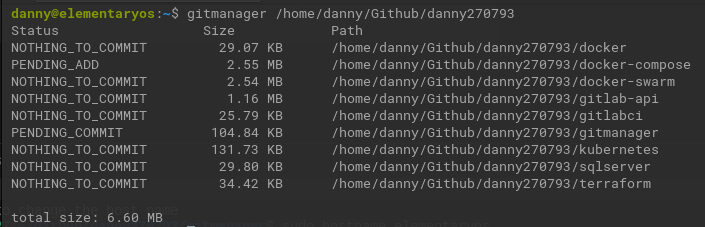

# GitManager

Finds all your git projects on specific folders and detect the states

## Installation

### From Github releases page

Go to [Release page](https://github.com/danny270793/gitmanager/releases) then download the binary which fits your environment

### From terminal

Get the last versión available on github

```bash
LAST_VERSION=$(curl https://api.github.com/repos/danny270793/GitManager/releases/latest | grep tag_name | cut -d '"' -f 4)
```

Download the last version directly to the binaries folder

For Linux (linux):

```bash
curl -L https://github.com/danny270793/GitManager/releases/download/${LAST_VERSION}/GitManager_${LAST_VERSION}_linux_amd64.tar.gz -o ./gitmanager.tar.gz
```

For MacOS (darwin):

```bash
curl -L https://github.com/danny270793/GitManager/releases/download/${LAST_VERSION}/GitManager_${LAST_VERSION}_darwin_amd64.tar.gz -o ./gitmanager.tar.gz
```

Untar the downloaded file

```bash
tar -xvf ./gitmanager.tar.gz
```

Then copy the binary to the binaries folder

```bash
sudo cp ./GitManager /usr/local/bin/gitmanager
```

Make it executable the binary

```bash
sudo chmod +x /usr/local/bin/gitmanager
```

```bash
gitmanager --version
```

## Ussage

Run the binary and pass the path to the folders where you want to search for git projects

```bash
gitmanager /path/1 /path/2 ...
```



## Follow me

* [Facebook](https://www.facebook.com/danny.vaca.9655)
* [Instagram](https://www.instagram.com/danny27071993/)
* [Youtube](https://www.youtube.com/channel/UC5MAQWU2s2VESTXaUo-ysgg)
* [Github](https://www.github.com/danny270793/)
* [LinkedIn](https://www.linkedin.com/in/danny270793)

## LICENSE

Licensed under the [MIT](license.md) License.

## Author

[@danny270793](https://github.com/danny270793)
